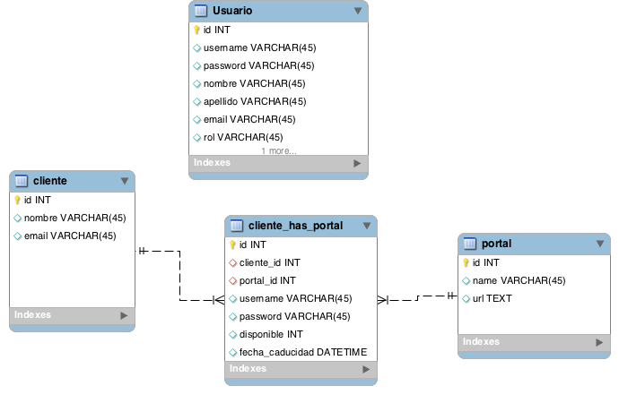
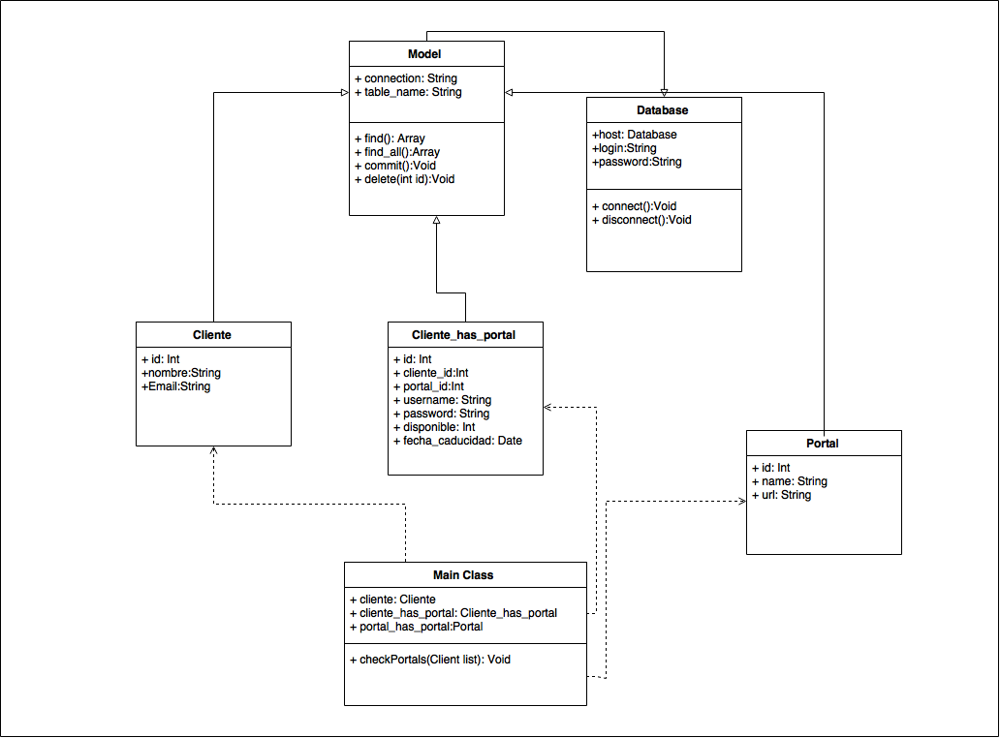

# Prueba tech-k

## Introducción
La siguiente prueba tiene por objetivó principal el conocer la capacidad de entender el tipo de problemas a los que se enfrentará el postulante en el ejercicio del cargo.

### Algoritmos

* Escriba una función que retorne la cantidad de 0's que posee n! (factorial). `Ej. 12! => 479001600 => 4.`

####Solución####
La solucion propuesta es obtener el mod de 10 del factorial del numero, si es 0, sumar 1 al contador, en el caso contrario omitir. Finalmente, se divide el numero en 10 y se repite el proceso hasta que el numero sea menor a 10.
```
ddef getZerosFactorial(number):
    '''
    Obtiene la cantidad de ceros del factorial de 'number'
    Args:
    - Number: Numero al cual se desea obtener el la cantidad de 0's de su factorial.
    Return:
    - Cantidad de 0's del factorial de number
    '''
    n=factorial(number)
    count=0
    while n > 10:
        mod=n%10
        if mod == 0:
            count+=1
        n=long(n/10)
    return count

```

En el archivo `test_1.py` se puede probar la funcion, el cual recibe como parametro el número al cual se le desea contar los 0's del factorial.


* Escriba una función/método que dado un número entero, entregue su representación en palabras.```Ej. 145 => “ciento cuarenta y cinco”.```

####Solución####

En el archivo `test_2.py` se puede probar la solucion, el cual recibe como parametro el número al cual se desea convertir en palabras. El codigo se basa en la solucion que se encuentra en el link de la referencia y se adapto a los requisitos del problema.


Referencias:
- https://gist.github.com/efrenfuentes/3785655




## Automatización de procesos
1. Diseñar la automatización de un proceso que compare una vez al día
los precios de los televisores LED que se encuentran en
www.falabella.cl con los que aparecen en www.ripley.cl.

####Requisitos
Para el desarrollo de esta actividad, se propone utilizar el lenguaje Python (version: 2.7), incluyendo las siguientes librerias:
* ```urllib2```, para la obtencion de la paginas web.
* ```BeautifulSoup4```, herramienta que facilita el parsing de HTML.


####Proceso####
El proceso completo se divide en 4 partes:

####Inicio####
* Se obtiene la URL de la sección de LEDS en la categoria TV de las dos empresas:
    * [Ripley](http://www.ripley.cl/ripley-chile/tecnologia/tv/led)
    * [Falabella](http://www.falabella.com/falabella-cl/category/cat2850014/LED)

* Como se desea comparar los productos de Falabella con los de Ripley, se debe generar una lista con las URL de todos los televisores que hay en el catalogo del link de Falabella. Para esto, a la direccion proporcionada anteriormente de falabella, se le agrega el parametro *Nrpp*, el cual se encarga de dividir la cantidad de productos que se muestran por pagina. Para ello, se le asigna un valor lo suficientemente alto para que la aplicacion entregue todos los televisores LED en una sola pagina (En este caso, utilizaremos el numero 100). Para el caso de Ripley, el parametro cambia a *pageSize* y se utiliza el mismo numero 100 para obtener los televisores.
` URL:http://www.falabella.com/falabella-cl/category/cat2850014/LED?Nrpp=100 `

* Usando la libreria ```urllib2```, se extrae todo el HTML de la URL mostrada anteriormente. Utilizando `BeautifulSoup4`, buscamos todos los div con la clase *quickView*, de los cuales extraemos la URL de los televisores, para posteriormente entrar a ellos y buscar el modelo y el precio de cada uno.

####Falabella####
* Con la lista de URL del proceso anterior, se busca en cada una el div con la clase *precio1*, el cual nos entrega el precio (Se le realiza un proceso de limpieza para eliminar caracteres indeseados como puntos, $ etc.).
* Para la obtencion del modelo, buscamos el componente th con el texto *Modelo* en su interior.
* Finalmente, insertamos a un diccionario con los productos de Falabella la tupla (modelo,precio) de cada televisor.


####Ripley####
* Como en el proceso anterior, utilizamos `BeautifulSoup4` para buscar div's, en este caso, con la clase *product_info*.
* Se itera por la lista del item anterior y se extraen los div con las clases *product_name* (Nombre del producto) y *price* (Precio). Para limpiar el modelo del televisor, se divide el texto que contiene *product_name* en espacios y se obtiene el ultimo elemento ya que el modelo del televisor esta siempre al final (Al igual que en Falabella, se extraen los caracteres indeseados del precio).
* Finalmente, insertamos a un diccionario con los productos de Ripley la tupla (modelo,precio) de cada televisor.

####Comparación####
* Para comparar, se itera sobre el diccionario de Ripley para buscar cada modelo del televisor en el diccionario de Falabella.
* Se insertan los precios de los modelos que se encuentran en los dos catalogos en un archivo, que se crea por dia.

###Nota###
* Para que la aplicacion se ejecute una vez por dia, a las 8:30 AM, se debe agregar la siguiente configuracion al `crontab`, utilizando el comando `crontab -e`:

```
30 8 * * * /usr/bin/python path_test/test_3/test_3.py
```
* La aplicacion `test_3.py` de la carpeta test_3, contiene (escrita en Python) las funciones que se consideran mas importantes.


2. En una base de datos se tienen registrados los portales de acceso de
y una serie de clientes junto con los datos de usuario y contraseña
de cada cliente para los portales que posee. Estas credenciales
caducan al cabo de un tiempo indeterminado, por lo que se debe
realizar un proceso automático que diariamente revise que
credenciales son válidas. En el caso que se encuentre una credencial
invalida se debe enviar un correo al cliente solicitando las nuevas
credenciales.

####Solución####

* Para este caso, se proponen la siguiente base de datos, modificando la anterior:



* Se agrego la tabla usuarios para las credenciales de autorizacion al sistema de administración. En la tabla cliente_has_portal, se agrega la disponibilidad de la credencial en el portal, y la fecha en que caduco.

* El modelo de clases de la solucion es el siguiente:



* Se propuso un arquitectura estilo ORM (Object-relation mapper), la cual mapea las tablas en clases para la obtencion de los datos.
